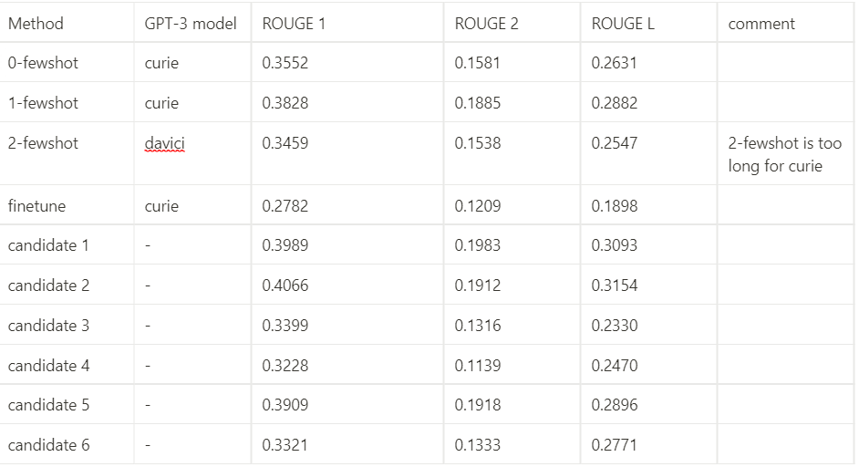

# openAI-ensemble

## 1. Usage

### 1.1 openAI API key setting
First set your openapi key in the environment variable OPENAI_API_KEY
```bash
OPENAI_API_KEY=YOUR_KEY
```

### 1.2 data preparation
prepare your data in the format of `example/data_format.json`
```json
{
    "Id": "<ID>",
    "original": "<YOUR PASSAGE>",
    "reference": "<REFERENCE SUMMARY>",
    "hypotheses": {
        "<CANDIDATE SOURCE 1>": {
            "content": "<CANDIDATE SUMMARY 1>",
            "metrics": {
                "rouge1": 0.0,
                "rouge2": 0.0,
                "rougeL": 0.0
            }
        },
        ...
        ,
        "<CANDIDATE SOURCE n>": {
            "content": "<CANDIDATE SUMMARY n>",
            "metrics": {
                "rouge1": 0.0,
                "rouge2": 0.0,
                "rougeL": 0.0
            }
        }
    }
}


```

### 1.3 run and generate the combined summary
To generate the summary, run
```bash
bash generate.sh
```
To finetune the model, run
```bash
bash finetune.sh
```
To clear the jobs records, run
```bash
bash clear_jobs.sh
```
## 2. What we aim to do

GPT-3 is well known for its summary generation ability and few-shot learning abilities. Currently, a lot of seq2seq models can generate high-quality summaries, whereas it is hard to select the best one, or merge the summaries into a better one. In this project, we aim to combine the summaries from different sources to generate a summary that is both coherent and accurate.

We conduct 2 ensemble methods using openAI GPT-3 API, both of them based on the completion task of GPT-3 task.

**The first method aims to the better prompt design.** Prompts are designed to guide GPT-3 to generate the combined summary of the input passage. The prompt consists of a leading passage, candidate summaries, and the expected combined summary output, prepended respectively by `Passage:`, `Summary <i>`, and `Combined summary:` , where `<i>` is the sequential number of the candidates.

```text
Passage:
(CNN)The Palestinian Authority officially became the 123rd member of the International Criminal Court on Wednesday, a step that gives the court jurisdiction over alleged crimes in Palestinian territories. ......

Summary 1:
The Palestinian Authority becomes the 123rd member of the International Criminal Court. The move gives the court jurisdiction over alleged crimes in Palestinian territories. Israel and the United States opposed the Palestinians' efforts to join the court.

Summary 2:
Palestinian Authority becomes 123rd member of the International Criminal Court. The move gives the court jurisdiction over alleged crimes in Palestinian territories. Israel and the United States opposed the Palestinians' efforts to join the body.

Summary 3:
The Palestinian Authority officially became the 123rd member of the International Criminal Court. The Palestinians signed the ICC's founding Rome Statute in January. The inquiry will include alleged war crimes committed in Palestinian territories. Israel and the United States opposed the Palestinians' efforts to join the body.

Combined summary:
Membership gives the ICC jurisdiction over alleged crimes committed in Palestinian territories since last June .\nIsrael and the United States opposed the move, which could open the door to war crimes investigations against Israelis .
```
The example above contain only one instance with gold combined output. The number of instances could be larger. However, due to the length limit of GPT-3 models, we could at most do experiments with 2 instances ahead. According to the number of instances, they are named `1-fewshot` and `2-fewshot` .

**The second method aims to ensemble the result after finetuning the model with the training dataset.** No leading instance with gold combined output here to guide GPT-3 to do few-shot during the inference. This method is named as `fintune`

Due to the limit of the free quota of openAI API, we only tested the performance on a small subset of the test dataset with 10 instances. The training dataset contains 100 instances, which are used to finetune the `curie` model for 4 epochs. In all of these experiments, *temperature* are set to 0.6, *max_tokens* are set to 150.


